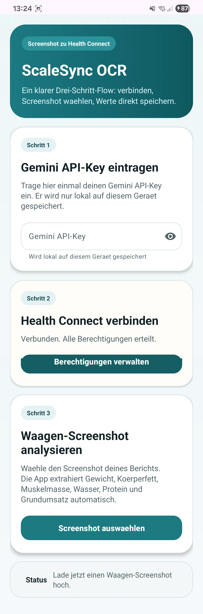

# ScaleSync OCR

Android app for importing body-composition scale screenshots into Health Connect.

This project is vibe coded.

[Download Latest APK](https://github.com/AWEplaysStuff/scalesync-ocr/releases/latest)

## App screenshot

## Fastest way to use it

1. Download the APK.
2. Open the app on your phone.
3. Paste your Gemini API key once into the in-app field.
4. Connect Health Connect.
5. Pick a screenshot and save the values.

No local.properties setup is needed for normal APK users.

## Share it

- Share the GitHub release link if you want people to install the app directly.
- Share the repository link if you want people to inspect the code or contribute.

## What it does

- Connects to Health Connect and requests the required write permissions
- Lets users enter their own Gemini API key directly inside the app
- Lets you pick a screenshot of a body-composition scale report
- Uses Gemini to extract the metrics from the screenshot
- Shows the extracted values in directly editable fields
- Saves the confirmed values to Health Connect using the current device time

## Extracted metrics

- Weight
- Body fat percentage
- Muscle mass percentage
- Bone mass
- Body water percentage
- Protein percentage
- BMI
- Basal metabolic rate

## Tech stack

- Kotlin
- Android ViewBinding
- Material 3
- Health Connect client
- Google Generative AI SDK for Android

## Build from source

1. Copy `local.properties.example` to `local.properties` if needed.
2. Set `sdk.dir` to your Android SDK path.
3. Build the app with `./gradlew.bat assembleDebug` on Windows.

## Permissions

The app requests write access for these Health Connect record types:

- Weight
- Body fat
- Lean body mass
- Bone mass
- Body water mass
- Basal metabolic rate

## Notes on secrets

- `local.properties` is ignored by git and must not be committed.
- Generated build outputs are ignored by git.
- User API keys are entered in-app and stored only on the local device.

## Project status

This repository is intended to be public-safe, but your local `local.properties` stays private on your machine.
